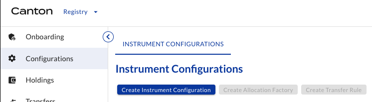

# Testnet Issuance - April xx, 2026 <!-- omit in toc -->

## Table of Contents <!-- omit in toc -->

- [Documentation](#documentation)
- [URLs \& Versions](#urls--versions)
- [PartyIDs](#partyids)
- [Status](#status)
  - [Step 1: Onboarding roles](#step-1-onboarding-roles)
  - [Step 2: Configuring tokens](#step-2-configuring-tokens)
  - [Step 3: Issuing tokens](#step-3-issuing-tokens)
  - [Step 4: Transfering tokens](#step-4-transfering-tokens)
- [Detailed instructions](#detailed-instructions)
  - [1.1 Credential User Service for all entities](#11-credential-user-service-for-all-entities)
  - [1.2 Registrar credential](#12-registrar-credential)
  - [1.3 Registrar onboarding](#13-registrar-onboarding)
  - [2.1 Registrar creates Allocation Factory and Transfer Rule](#21-registrar-creates-allocation-factory-and-transfer-rule)
  - [2.2 Registrar specifies Instrument Configuration](#22-registrar-specifies-instrument-configuration)
  - [2.3 Registrar offers credentials to Issuer and Holders](#23-registrar-offers-credentials-to-issuer-and-holders)
  - [2.4 Investors create Transfer Preapproval](#24-investors-create-transfer-preapproval)
  - [3.1 Issuer requests token issuance (minting)](#31-issuer-requests-token-issuance-minting)
  - [3.2 Registrar accepts and tokens are issued](#32-registrar-accepts-and-tokens-are-issued)
  - [3.3 Issuer offers token transfer to Investor1](#33-issuer-offers-token-transfer-to-investor1)
  - [3.4 Investor1 confirms holdings](#34-investor1-confirms-holdings)
  - [4.1 Investor1 offers token transfer to Investor2](#41-investor1-offers-token-transfer-to-investor2)
  - [4.2 Investor2 confirms holdings](#42-investor2-confirms-holdings)

## Documentation

- [Issuing Tokenized Instruments](https://docs.digitalasset.com/utilities/testnet/tutorials/issuance/introduction.html)
- [Transfering Tokenized Instruments](https://docs.digitalasset.com/utilities/testnet/tutorials/transfer/index.html)
- [Redeeming Tokenized Instruments](https://docs.digitalasset.com/utilities/testnet/tutorials/redemption/index.html)

## URLs & Versions

| Entity           | Details                                            | Utility UI version |
| :--------------- | :------------------------------------------------- | ------------------ |
| Registrar/Issuer | https://utilities.vp-demo.digitalasset-staging.com | 0.11.2             |
| Investor1        | https://utilities.vp-demo.digitalasset-staging.com | 0.11.2             |
| Investor2        | https://utilities.vp-demo.digitalasset-staging.com | 0.11.2             |

## PartyIDs

| Entity           | Party ID                                                                                          |
| :--------------- | :------------------------------------------------------------------------------------------------ |
| Registrar/Issuer | `DigitalAsset-capconnect-Registrar::1220767bbebdd9ee1f72b0f7817817009170caa0f8180358831f3f0fac17e052002a`    |
| Investor1        | `DigitalAsset-capconnect-Investor1::1220767bbebdd9ee1f72b0f7817817009170caa0f8180358831f3f0fac17e052002a` |
| Investor2        | `DigitalAsset-capconnect-Investor2::1220767bbebdd9ee1f72b0f7817817009170caa0f8180358831f3f0fac17e052002a` |

## Status

### Step 1: Onboarding roles

| Steps                                                                                        | DA   | Registrar/Issuer | Investor1 | Investor2 |
| :------------------------------------------------------------------------------------------- | :--- | :--------------- | :-------- | :-------- |
| [1.1 Credential User Service for all entities](#11-credential-user-service-for-all-entities) | -    | ✅                | ✅         | ✅         |
| [1.2 Registrar credential](#12-registrar-credential)                                         | 📌    | -                | -         | -         |
| [1.3 Registrar onboarding](#13-registrar-onboarding)                                         | 📌    | 📌                | -         | -         |

### Step 2: Configuring tokens

| Steps                                                                                                                    | DA   | Registrar/Issuer | Investor1 | Investor2 |
| :----------------------------------------------------------------------------------------------------------------------- | :--- | :--------------- | :-------- | :-------- |
| [2.1 Registrar creates Allocation Factory and Transfer Rule](#21-registrar-creates-allocation-factory-and-transfer-rule) | -    | 📌                | -         | -         |
| [2.2 Registrar specifies Instrument Configuration](#22-registrar-specifies-instrument-configuration)                     | -    | 📌                | -         | -         |
| [2.3 Registrar offers credentials to Issuer and Holders](#23-registrar-offers-credentials-to-issuer-and-holders)         | -    | 📌                | 📌         | 📌         |
| [2.4 Investors create Transfer Preapproval](#24-investors-create-transfer-preapproval)                                   | -    | -                | 📌         | 📌         |

### Step 3: Issuing tokens

| Steps                                                                                          | DA   | Registrar/Issuer | Investor1 | Investor2 |
| :--------------------------------------------------------------------------------------------- | :--- | :--------------- | :-------- | :-------- |
| [3.1 Issuer requests token issuance (minting)](#31-issuer-requests-token-issuance-minting)     | -    | 📌                | -         | -         |
| [3.2 Registrar accepts and tokens are issued](#32-registrar-accepts-and-tokens-are-issued)     | -    | 📌                | -         | -         |
| [3.3 Issuer offers token transfer to Investor1](#33-issuer-offers-token-transfer-to-investor1) | -    | 📌                | -         | -         |
| [3.4 Investor1 confirms holdings](#34-investor1-confirms-holdings)                             | -    | -                | 📌         | -         |

### Step 4: Transfering tokens

| Steps                                                                                                | DA   | Registrar/Issuer | Investor1 | Investor2 |
| :--------------------------------------------------------------------------------------------------- | :--- | :--------------- | :-------- | :-------- |
| [4.1 Investor1 offers token transfer to Investor2](#41-investor1-offers-token-transfer-to-investor2) | -    | -                | 📌         | -         |
| [4.2 Investor2 confirms holdings](#42-investor2-confirms-holdings)                                   | -    | -                | -         | 📌         |

## Detailed instructions

### 1.1 Credential User Service for all entities

| Actor        | Module     | Tab        |
| :----------- | :--------- | :--------- |
| All entities | Credential | Onboarding |

All entities `Request Credential User Service`.

See [tutorial](https://docs.digitalasset.com/utilities/testnet/tutorials/issuance/1-onboarding.html#onboarding-credential-services-for-all-entities) for details.

### 1.2 Registrar credential

| Actors                | Module     | Tab                 |
| :-------------------- | :--------- | :------------------ |
| DA, Registar / Issuer | Credential | Credentials, Offers |

DA offers Registrar credential (Credentials tab), and Registrar accepts it (Offers tab):

| Item        | Value                                                                                          |
| :---------- | :--------------------------------------------------------------------------------------------- |
| holder      | `DigitalAsset-capconnect-Registrar::1220767bbebdd9ee1f72b0f7817817009170caa0f8180358831f3f0fac17e052002a` |
| id          | `Registrar MS Issuer`                                                                |
| description | `Registrar MS Issuer`                                                                |
| Subject     | `DigitalAsset-capconnect-Registrar::1220767bbebdd9ee1f72b0f7817817009170caa0f8180358831f3f0fac17e052002a` |
| Property    | `hasRegistryRole`                                                                              |
| Value       | `Registrar`                                                                                    |

See [tutorial](https://docs.digitalasset.com/utilities/testnet/tutorials/issuance/1-onboarding.html#provider-offers-registrar-credential)for details.

### 1.3 Registrar onboarding

| Actors               | Module   | Tab        |
| :------------------- | :------- | :--------- |
| Registrar/Issuer, DA | Registry | Onboarding |

Registrar clicks on `Request Registrar Service`, and DA accepts.

| Item     | Value                                                                                                |
| :------- | :--------------------------------------------------------------------------------------------------- |
| Provider | `DigitalAsset-UtilityOperator::12202679f2bbe57d8cba9ef3cee847ac8239df0877105ab1f01a77d47477fdce1204` |

See [tutorial](https://docs.digitalasset.com/utilities/testnet/tutorials/issuance/1-onboarding.html#registrar-requests-onboarding-as-a-registrar-in-the-registry) for details.

### 2.1 Registrar creates Allocation Factory and Transfer Rule

| Actors           | Module   | Tab           |
| :--------------- | :------- | :------------ |
| Registrar/Issuer | Registry | Configuration |

Registrar clicks on `Create Allocation Factory` and `Create Transfer Rule`.

Both boxes should turn from blue to grey.

### 2.2 Registrar specifies Instrument Configuration

| Actors           | Module   | Tab           |
| :--------------- | :------- | :------------ |
| Registrar/Issuer | Registry | Configuration |

Registrar creates Instrument Configuration:

| Item                        | Value                                                                                          |
| :-------------------------- | :--------------------------------------------------------------------------------------------- |
| Instrument ID               | `CCP-CP-TESTNET`                                                                            |
| Identifiers                 |                                                                                                |
| Source                      | `DigitalAsset-capconnect-Registrar::1220767bbebdd9ee1f72b0f7817817009170caa0f8180358831f3f0fac17e052002a` |
| Id                          | `CCP-CP`                                                                                    |
| Scheme                      | DTI                                                                                            |
| Requirement for Mint Issuer |                                                                                                |
| Credential Issuer           | `DigitalAsset-capconnect-Registrar::1220767bbebdd9ee1f72b0f7817817009170caa0f8180358831f3f0fac17e052002a` |
| Property                    | `isIssuerOf`                                                                                   |
| Value                       | `CCP-CP`                                                                                    |
| Requirement for Holders     |                                                                                                |
| Credential Issuer           | `DigitalAsset-capconnect-Registrar::1220767bbebdd9ee1f72b0f7817817009170caa0f8180358831f3f0fac17e052002a` |
| Property                    | `isHolderOf`                                                                                   |
| Value                       | `CCP-CP`                                                                                    |

See [tutorial](https://docs.digitalasset.com/utilities/testnet/tutorials/issuance/2-credentials.html#registrar-specifying-the-requirement-of-the-bond-token) for details.

### 2.3 Registrar offers credentials to Issuer and Holders

| Actors                                 | Module     | Tab                 |
| :------------------------------------- | :--------- | :------------------ |
| Registrar/Issuer, Investor1, Investor2 | Credential | Credentials, Offers |

Registrar issues free credentials (Credentials tab), and Issuer, Investor1, and Investor2 accept them (Offers tab).

Credential to issue CCP-CP:

| Item        | Value                                                                                          |
| :---------- | :--------------------------------------------------------------------------------------------- |
| holder      | `DigitalAsset-capconnect-Registrar::1220767bbebdd9ee1f72b0f7817817009170caa0f8180358831f3f0fac17e052002a` |
| id          | `Issuer-CCP-CP-Issuer`                                                                      |
| description | `Issuer-CCP-CP-Issuer`                                                                      |
| Subject     | `DigitalAsset-capconnect-Registrar::1220767bbebdd9ee1f72b0f7817817009170caa0f8180358831f3f0fac17e052002a` |
| Property    | `isIssuerOf`                                                                                   |
| Value       | `CCP-CP`                                                                                    |

Credentials to hold CCP-CP:

| Item        | Value                                                                                          |
| :---------- | :--------------------------------------------------------------------------------------------- |
| holder      | `DigitalAsset-capconnect-Registrar::1220767bbebdd9ee1f72b0f7817817009170caa0f8180358831f3f0fac17e052002a` |
| id          | `Issuer-CCP-CP-Holder`                                                                      |
| description | `Issuer-CCP-CP-Holder`                                                                      |
| Subject     | `DigitalAsset-capconnect-Registrar::1220767bbebdd9ee1f72b0f7817817009170caa0f8180358831f3f0fac17e052002a` |
| Property    | `isHolderOf`                                                                                   |
| Value       | `CCP-CP`                                                                                    |

| Item        | Value                                                                                                      |
| :---------- | :--------------------------------------------------------------------------------------------------------- |
| holder      | `auth0_007c692dafd3a671ed48e985f245::1220f36652a7487f93853ac8dcc7ed9e64c32c7caebf8c715e83c8581dba855a37ca` |
| id          | `Investor1-CCP-CP-Holder`                                                                               |
| description | `Investor1-CCP-CP-Holder`                                                                               |
| Subject     | `auth0_007c692dafd3a671ed48e985f245::1220f36652a7487f93853ac8dcc7ed9e64c32c7caebf8c715e83c8581dba855a37ca` |
| Property    | `isHolderOf`                                                                                               |
| Value       | `CCP-CP`                                                                                                |

| Item        | Value                                                                                             |
| :---------- | :------------------------------------------------------------------------------------------------ |
| holder      | `DigitalAsset-capconnect-Investor2::1220767bbebdd9ee1f72b0f7817817009170caa0f8180358831f3f0fac17e052002a` |
| id          | `Investor2-CCP-CP-Holder`                                                                      |
| description | `Investor2-CCP-CP-Holder`                                                                      |
| Subject     | `DigitalAsset-capconnect-Investor2::1220767bbebdd9ee1f72b0f7817817009170caa0f8180358831f3f0fac17e052002a` |
| Property    | `isHolderOf`                                                                                      |
| Value       | `CCP-CP`                                                                                       |

See [tutorial](https://docs.digitalasset.com/utilities/testnet/tutorials/issuance/2-credentials.html#registrar-offers-credential-of-token-issuer-and-holder-to-issuer) for details.

### 2.4 Investors create Transfer Preapproval

| Actors               | Module   | Tab       |
| :------------------- | :------- | :-------- |
| Investor1, Investor2 | Registry | Transfers |

Investors create Transfer Preapproval (Transfer tab) for all instruments issued by the Registrar/Issuer.

| Item                        | Value                                                                                          |
| :-------------------------- | :--------------------------------------------------------------------------------------------- |
| Instrument Admin            | `DigitalAsset-capconnect-Registrar::1220767bbebdd9ee1f72b0f7817817009170caa0f8180358831f3f0fac17e052002a` |
| All Instruments preapproved | `yes`                                                                                          |

### 3.1 Issuer requests token issuance (minting)

| Actors           | Module   | Tab   |
| :--------------- | :------- | :---- |
| Registrar/Issuer | Registry | Mints |

| Item       | Value                                                                                          |
| :--------- | :--------------------------------------------------------------------------------------------- |
| Instrument | `CCP-CP-TESTNET`                                                                            |
| Amount     | `100000000`                                                                                     |
| Registrar  | `DigitalAsset-capconnect-Registrar::1220767bbebdd9ee1f72b0f7817817009170caa0f8180358831f3f0fac17e052002a` |
| Reference  | `CCP-CP-TESTNET $100m issued Apr-2026`                                                       |

See [tutorial](https://docs.digitalasset.com/utilities/testnet/tutorials/issuance/3-issuance.html#issuer-requests-token-issuance-minting) for details.

### 3.2 Registrar accepts and tokens are issued

| Actors           | Module   | Tab   |
| :--------------- | :------- | :---- |
| Registrar/Issuer | Registry | Mints |

Registrar accepts and tokens are issued.

See [tutorial](https://docs.digitalasset.com/utilities/testnet/tutorials/issuance/3-issuance.html#registrar-accepts-and-tokens-are-issued) for details.

### 3.3 Issuer offers token transfer to Investor1

| Actors           | Module   | Tab      |
| :--------------- | :------- | :------- |
| Registrar/Issuer | Registry | Holdings |

Issuer transfers tokens to Investor1. (3 dots menu on the right of the holding / `Transfer` )

| Item       | Value                                                                                                      |
| :--------- | :--------------------------------------------------------------------------------------------------------- |
| Send from  | `DigitalAsset-capconnect-Registrar::1220767bbebdd9ee1f72b0f7817817009170caa0f8180358831f3f0fac17e052002a`             |
| Send to    | `auth0_007c692dafd3a671ed48e985f245::1220f36652a7487f93853ac8dcc7ed9e64c32c7caebf8c715e83c8581dba855a37ca` |
| Instrument | `CCP-CP-TESTNET`                                                                                        |
| Amount     | `80000000`                                                                                                  |
| Reference  | `CCP-CP-TESTNET $80m placement to Investor1`                                                             |

See [tutorial](https://docs.digitalasset.com/utilities/testnet/tutorials/issuance/3-issuance.html#issuer-offers-token-transfer-to-investor1) for details.

### 3.4 Investor1 confirms holdings

| Actors    | Module   | Tab      |
| :-------- | :------- | :------- |
| Investor1 | Registry | Holdings |

Investor1 confirms holdings.

### 4.1 Investor1 offers token transfer to Investor2

| Actors           | Module   | Tab      |
| :--------------- | :------- | :------- |
| Registrar/Issuer | Registry | Holdings |

Investor1 transfers tokens to Investor2. (3 dots menu on the right of the holding / `Transfer` )

| Item       | Value                                                                                                      |
| :--------- | :--------------------------------------------------------------------------------------------------------- |
| Send from  | `auth0_007c692dafd3a671ed48e985f245::1220f36652a7487f93853ac8dcc7ed9e64c32c7caebf8c715e83c8581dba855a37ca` |
| Send to    | `DigitalAsset-capconnect-Investor2::1220767bbebdd9ee1f72b0f7817817009170caa0f8180358831f3f0fac17e052002a`          |
| Instrument | `CCP-CP-TESTNET`                                                                                        |
| Amount     | `30000000`                                                                                                  |
| Reference  | `CCP-CP-TESTNET $30m transfer from Investor1 to Investor2`                                               |

See [tutorial](https://docs.digitalasset.com/utilities/testnet/tutorials/issuance/3-issuance.html#issuer-offers-token-transfer-to-investor1) for details.

### 4.2 Investor2 confirms holdings

| Actors    | Module   | Tab      |
| :-------- | :------- | :------- |
| Investor2 | Registry | Holdings |

Investor2 confirms holdings.
